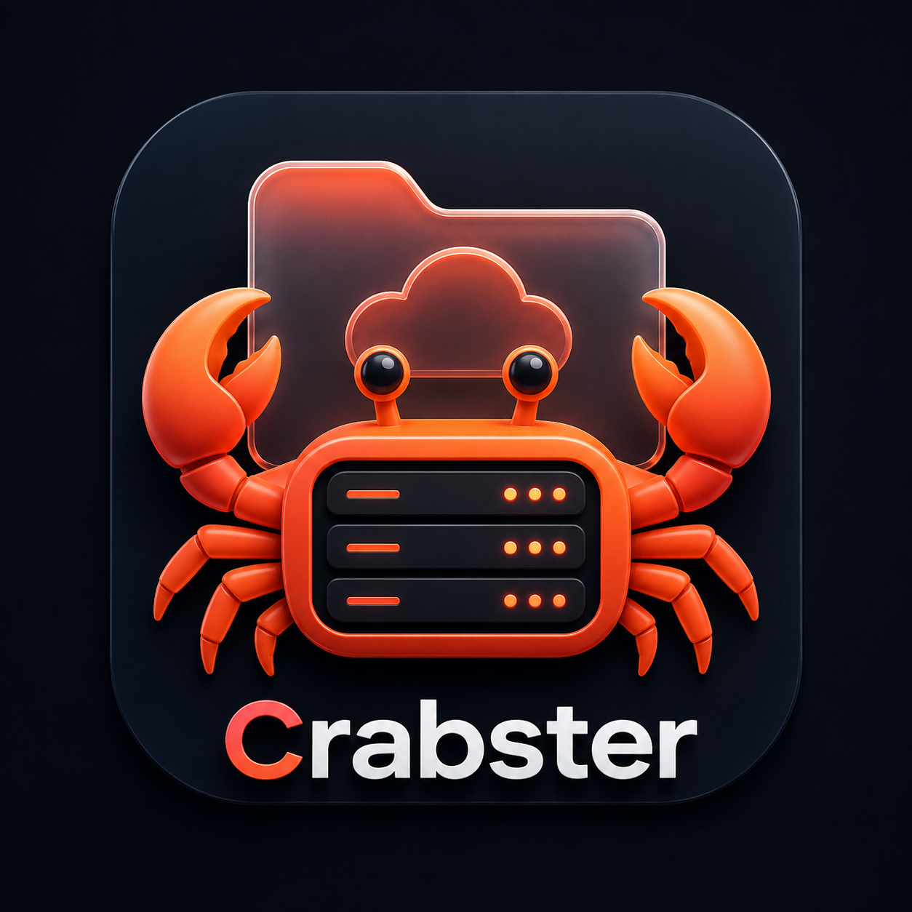

<p align="center">
  
</p>

<h1 align="center">🦀 Crabster</h1>

<p align="center">
  
  
</p>

<p align="center">
  <strong>Быстрый, легкий и эстетичный файловый сервер на Rust</strong>
</p>

---

**Crabster** — это быстрый, легкий и эстетичный файловый сервер, написанный на Rust. Он поставляется в виде одного бинарного файла, который включает в себя современный веб-интерфейс на Svelte.

## ✨ Основные возможности

- 🚀 **Одиночный бинарник**: Фронтенд встроен в исполняемый файл. Никаких внешних зависимостей.
- 🎨 **Премиальный UI**: Темная тема, стеклянный морфизм (glassmorphism) и плавная анимация.
- 📁 **Управление файлами**: Загрузка (drag-and-drop), скачивание, создание папок и удаление.
- 👁️ **Предпросмотр**: Встроенный просмотр для:
    - Изображений (PNG, JPG, SVG, WebP)
    - Видео (MP4, WebM) и Аудио (MP3, WAV)
    - Документов PDF
    - Исходного кода и текста с подсветкой
- 🔒 **Безопасность**:
    - Режим «только чтение» (`--readonly`)
    - Запрет только на удаление (`--no-delete`)
    - Доступ по коду/паролю (`--auth`)
- 😈 **Режим демона**: Запуск в фоне, управление списком активных серверов и остановка по ID.
- ⌨️ **Автодополнение**: Поддержка Bash, Zsh и Fish с динамическими подсказками ID инстансов.

---

## 🚀 Быстрый старт

### Установка (Debian/Ubuntu)
Если у вас есть готовый `.deb` пакет:
```bash
sudo dpkg -i crabster_0.1.0_amd64.deb
```

### Запуск
```bash
# Обычный запуск в текущей директории (порт 8080)
crabster

# Запуск в фоне (демон)
crabster -d --port 9000 --dir ./my-files

# Посмотреть запущенные в фоне серверы
crabster ps

# Остановить сервер по ID
crabster stop <id>

# Просмотреть логи сервера
crabster logs <id>
```

---

## 🛠️ Командная строка

| Флаг | Описание |
| :--- | :--- |
| `-p, --port` | Порт для прослушивания (по умолчанию 8080) |
| `-b, --bind` | Адрес привязки (по умолчанию 0.0.0.0) |
| `--dir` | Директория для раздачи |
| `-r, --readonly` | Режим «только чтение» |
| `--no-delete` | Запретить удаление файлов |
| `-d, --daemon` | Запустить как фоновый процесс |
| `--auth <CODE>` | Установить код доступа к веб-интерфейсу |

### Команды:
- `crabster start` — запуск сервера (по умолчанию).
- `crabster ps` — список фоновых инстансов.
- `crabster stop <id>` — остановить инстанс.
- `crabster logs <id>` — просмотр логов инстанса.

---

## 📦 Сборка из исходников

### Требования:
- Rust (Cargo)
- Node.js (npm)

### Шаги сборки:
1. **Сборка фронтенда**:
   ```bash
   cd web && npm install && npm run build && cd ..
   ```
2. **Сборка бинарного файла**:
   ```bash
   cargo build --release
   ```
   Бинарник будет находиться в `target/release/crabster`.

---

## 🤖 CI/CD и Релизы
Проект полностью настроен для GitHub Actions:
- **CI**: Автоматическая проверка кода и сборка при каждом коммите.
- **Release**: При создании тега (например, `v0.1.0`) GitHub автоматически создаст релиз и прикрепит к нему скомпилированный `.deb` пакет и бинарник.

---

## 📜 Лицензия
Проект распространяется под лицензией [MIT](LICENSE).
